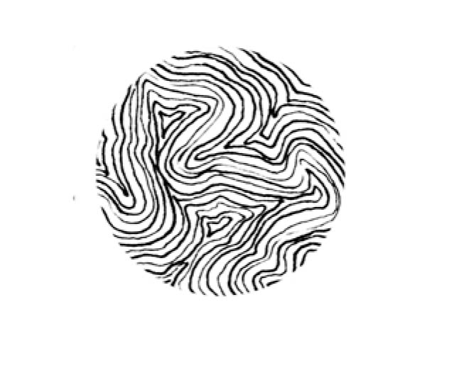

## LyDav la mejor pagina del mundo

Esto es lo mejoooor de todo 



### Markdown

Markdown is a lightweight and easy-to-use syntax for styling your writing. It includes conventions for

```markdown
Syntax highlighted code block

# Esto es un texto de prueba 1
## Esto es un texto de prueba 2
### Esto es un texto de prueba 3

Vamos a ver

1. Texto de prueeeeeba
2. Texto de prueeeeeba


[Link](url) and [CoverFormat.jpg](CoverFormat.jpg)
```

For more details see [GitHub Flavored Markdown](https://guides.github.com/features/mastering-markdown/).

### Jekyll Themes

Your Pages site will use the layout and styles from the Jekyll theme you have selected in your [repository settings](https://github.com/lydav/lydav/settings). The name of this theme is saved in the Jekyll `_config.yml` configuration file.

### Support or Contact

Having trouble with Pages? Check out our [documentation](https://docs.github.com/categories/github-pages-basics/) or [contact support](https://github.com/contact) and we’ll help you sort it out.
